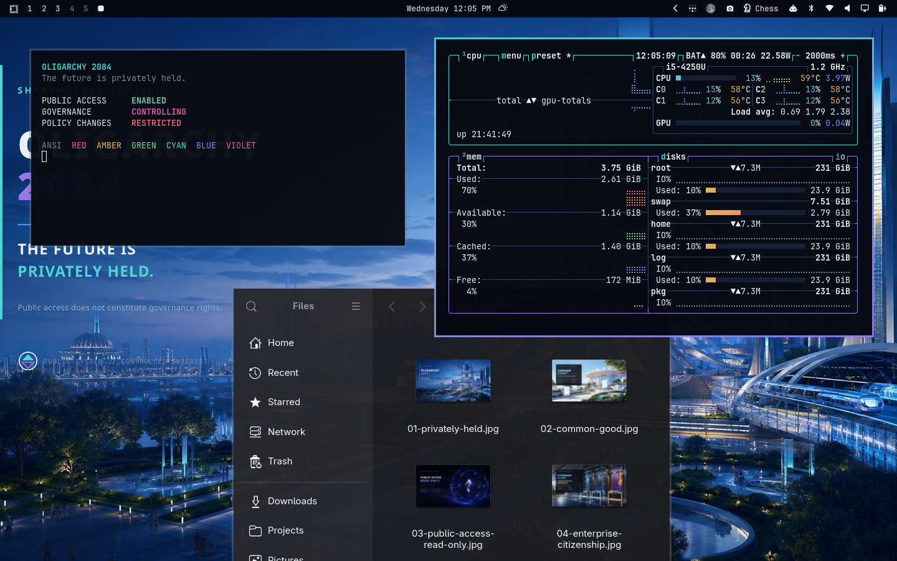
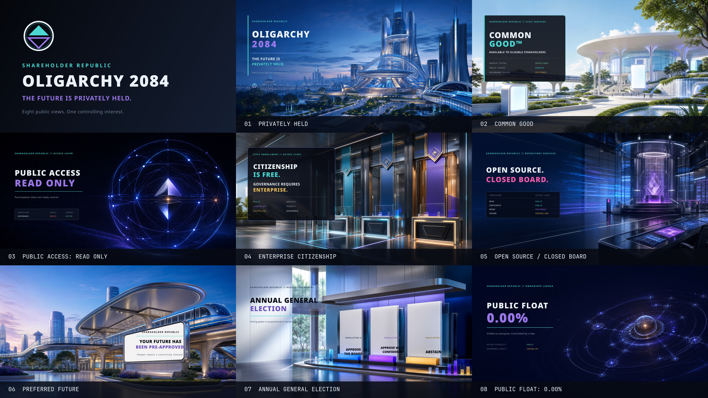

# Oligarchy 2084

> **The future is privately held.**

Oligarchy 2084 is a retro-futurist dark theme for
[Omarchy](https://omarchy.org). It combines civic navy, chrome white, electric
cyan, signal blue, preferred violet, and restrained magenta with a fictional
Shareholder Republic where the public gets the platform and ownership retains
the permissions.





## Install

```bash
omarchy theme install https://github.com/rodrix2000/omarchy-oligarchy-2084-theme
```

The repository name resolves to the installed theme slug `oligarchy-2084`.

## Included

- Eight coordinated 4K backgrounds
- Semantic colors for supported Omarchy surfaces and applications
- Matching btop, Chromium, icon, and keyboard-color files
- Transparent ownership/access unlock emblem
- Four dedicated 3440×1440 ultrawide compositions
- Two optional 1600×900 screensaver source images
- No scripts, daemons, telemetry, plugins, or permission changes

## Palette

| Role | Hex |
| --- | --- |
| Void | `#04060B` |
| Background | `#070A12` |
| Surface | `#0E1524` |
| Raised surface | `#151F33` |
| Foreground | `#EAF2F7` |
| Muted steel | `#6F7F96` |
| Civic cyan | `#4BD6D2` |
| Signal blue | `#6C8CFF` |
| Preferred violet | `#9A77E8` |
| Policy magenta | `#E85AA8` |
| Approval amber | `#E6B75A` |
| Urgent coral | `#F0626E` |
| Service green | `#76D6A4` |

`colors.toml` is the semantic source used by current Omarchy Quattro to
generate treatments for the shell, terminals, editors, Hyprland, and other
supported applications. The included `btop.theme` and other permitted color
files provide deliberate application-specific finishing.

## Backgrounds

| File | Concept |
| --- | --- |
| `01-privately-held.jpg` | Public plaza beneath a privately controlled arcology |
| `02-common-good.jpg` | Optimistic civic services with preferred governance access |
| `03-public-access-read-only.jpg` | Minimal public network and controlling core |
| `04-enterprise-citizenship.jpg` | Civic access tiers presented as enterprise enrollment |
| `05-open-source-closed-board.jpg` | Public code with ownership-gated merge control |
| `06-preferred-future.jpg` | A transit future already approved on the public's behalf |
| `07-annual-general-election.jpg` | A shareholder resolution dressed as civic participation |
| `08-public-float-zero.jpg` | A visible public system with no public control |

Ultrawide alternatives, screensaver sources, text-free masters, the emblem
source, asset manifest, production prompts, and audit notes live under
[`extras/`](extras/).

## Safety and scope

This repository changes appearance only. It ships no executable payload and
does not modify authentication, permissions, services, packages, or network
behavior. Current Omarchy also filters code-bearing files from themes installed
from Git; this repository does not include any such files.

## License

Configuration and documentation are released under the [MIT License](LICENSE).
Original visual assets are released under
[Creative Commons Attribution 4.0 International](LICENSE-ASSETS.md).

The Shareholder Republic is fictional. This project is not affiliated with or
endorsed by a real company, political organization, or person.

**Public code. Private governance.**

